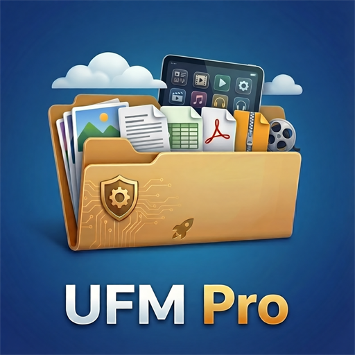

<div align="center">
  

  <h1>Ultimate File Manager Pro</h1>

  <p><b>The Ultimate Dual-Pane File Manager for Android Mobile, Android TV, and Windows PC.</b></p>

  <p>🌐 <b>Official Website:</b> <a href="https://www.kilowatch.co.za"><b>www.kilowatch.co.za</b></a></p>

  <p>
    <a href="https://www.kilowatch.co.za"></a>
    <a href="https://github.com/Kilowatch/ultimate-file-manager-pro/releases"></a>
    <a href="https://play.google.com/store/apps/details?id=za.kilowatch.ultimatefilemanager"></a>
    <a href="LICENSE"></a>
    <a href="https://github.com/sponsors/Kilowatch"></a>
    <a href="https://xdaforums.com/t/app-free-ultimate-file-manager-pro-dual-pane-android-mobile-android-tv-foss-edition-available.4791958/"></a>
    <a href="https://www.reddit.com/r/UFManagerPro/"></a>
  </p>
</div>

---

## 🌟 Overview

**Ultimate File Manager Pro (UFM)** is a high-performance, feature-packed dual-pane file manager designed for power users across **Android Mobile**, **Android TV / Fire TV**, and **Windows PC**. Built with privacy, efficiency, and speed in mind, UFM allows seamless side-by-side file operations, LAN auto-discovery, remote PC pairing, and multi-protocol network storage access.

This repository contains the official **Free and Open Source Software (FOSS)** edition of UFM.

---

## 📦 Download Releases

Pre-compiled production binaries for all supported platforms are published on every [GitHub Release](https://github.com/Kilowatch/ultimate-file-manager-pro/releases/latest).

| Target Platform | Asset File Name | Description | Type |
|---|---|---|---|
| 📱 **Android Mobile** | [`mobile-foss-release.apk`](https://github.com/Kilowatch/ultimate-file-manager-pro/releases/latest/download/mobile-foss-release.apk) | Phones & Tablets build | APK Package |
| 📺 **Android TV / Fire TV** | [`tv-foss-release.apk`](https://github.com/Kilowatch/ultimate-file-manager-pro/releases/latest/download/tv-foss-release.apk) | D-pad remote optimized TV build | APK Package |
| 💻 **Windows Desktop** | [`ufm-windows-portable.exe`](https://github.com/Kilowatch/ultimate-file-manager-pro/releases/latest/download/ufm-windows-portable.exe) | Single-file portable companion (No installation required) | Standalone EXE |
| 💻 **Windows Desktop** | [`UltimateFileManagerProCompanion_x64-setup.exe`](https://github.com/Kilowatch/ultimate-file-manager-pro/releases/latest/download/UltimateFileManagerProCompanion_x64-setup.exe) | 64-bit Windows Setup Installer | Setup EXE |
| 💻 **Windows Desktop** | [`UltimateFileManagerProCompanion_x64_en-US.msi`](https://github.com/Kilowatch/ultimate-file-manager-pro/releases/latest/download/UltimateFileManagerProCompanion_x64_en-US.msi) | 64-bit Windows MSI Package Installer | MSI Installer |
| 📦 **Source Code** | [GitHub Releases](https://github.com/Kilowatch/ultimate-file-manager-pro/releases/latest) | Complete source code archives | Zip / Tarball |

> [!TIP]
> **Quick Installation on Android TV / Fire TV:**
> You can quickly install the TV edition on TV devices using the popular **Downloader** app by AFTVnews (available on Amazon Appstore & Google Play Store):
> 1. Open the **Downloader** app on your TV device.
> 2. Enter Quick Code **`1581139`** in the URL / Search bar.
> 3. The TV APK will automatically download and start installation.

---

## ✨ Features

- ⚡ **Dual-Pane Efficiency**: Side-by-side file viewing and management for effortless drag, drop, copy, and move operations.
- 🖥️ **Native Windows PC Companion**: Connect your PC and Android device over local Wi-Fi with PIN authentication and TLS certificate pinning—no cloud required.
- 🚀 **1-Click APK Sideloading**: Drag-and-drop `.apk` or `.xapk` files onto the PC Companion zone to install them remotely on your TV or phone.
- ☁️ **Self-Hosted Network Storage**: Full integration with **SMB**, **SFTP**, **FTP**, **WebDAV**, and **AWS S3**.
- 🛡️ **100% Privacy & FOSS**: Free of closed-source SDKs, Google tracking services, and invasive analytics.
- 📺 **Android TV Native Interface**: Full D-pad navigation, Leanback UI design, and quick action bars tailored for big-screen remotes.

---

## ⚖️ FOSS Edition vs. Store Edition

To comply with open-source software guidelines and maximize privacy, the **FOSS build** removes all proprietary analytics and store dependencies:

| Feature / Component | FOSS Build (GitHub) | Store Build (Google Play / Amazon) |
|---|---|---|
| **Privacy & Analytics** | 🚫 Zero Trackers / Zero Telemetry | Google Firebase / Crashlytics |
| **Proprietary Cloud (Google Drive, OneDrive, Dropbox)** | 🚫 Omitted (Requires closed SDKs) | ✅ Included |
| **Open Cloud (WebDAV, SFTP, SMB, FTP, S3)** | ✅ Full Access | ✅ Full Access |
| **In-App Billing** | 🚫 Direct GitHub Sponsor links | Google Play Store Billing |
| **Source Code License** | GPL v3.0 | Proprietary Build Variants |

---

## 🖥️ Windows Companion App

UFM includes a native Windows desktop companion built with Rust and Tauri for ultra-low resource usage and instant performance.

| Feature | Details |
|---|---|
| 📁 **Dual-Pane File Browser** | Browse local Windows drives alongside connected Android filesystems |
| ⬆️⬇️ **Wi-Fi Transfer** | Fast folder tree sync and byte-accurate transfer progress |
| 📦 **Remote Sideloading** | Instantly sideload applications onto TV or Mobile from your desktop |
| 🔐 **Local Security** | High-security TLS handshake with dynamic PIN verification |
| 🔍 **Zero-Conf Discovery** | Automatic LAN discovery (mDNS / local broadcast) |

### Building the Windows Companion
```bash
cd UFM-Windows
npm install
npm run tauri dev      # Development mode
npm run tauri build    # Production build (.exe & .msi)
```
*Detailed Windows documentation can be found at [UFM-Windows/README.md](UFM-Windows/README.md).*

---

## 🛠️ Building the Android App

To compile UFM from source using Gradle:

### Debug Builds (For local development)
```bash
# Android Mobile
./gradlew assembleMobileFossDebug

# Android TV
./gradlew assembleTvFossDebug
```

### Production Release Builds
```bash
# Android Mobile Release
./gradlew assembleMobileFossRelease

# Android TV Release
./gradlew assembleTvFossRelease
```
*Note: Signed release packages require configured signing keys in `app/build.gradle.kts` or `apksigner`.*

---

## 💖 Community & Support

Support project development, ask questions, or connect with the community:

- 🌐 **Website**: [www.kilowatch.co.za](https://www.kilowatch.co.za)
- 💖 **GitHub Sponsors**: [Sponsor @Kilowatch](https://github.com/sponsors/Kilowatch)
- 💬 **XDA Developers Forum**: [Ultimate File Manager Pro on XDA](https://xdaforums.com/t/app-free-ultimate-file-manager-pro-dual-pane-android-mobile-android-tv-foss-edition-available.4791958/)
- Reddit Community: [r/UFManagerPro](https://www.reddit.com/r/UFManagerPro/)

---

## 📄 License

Ultimate File Manager Pro is licensed under the **GNU General Public License v3.0**. See the [LICENSE](LICENSE) file for complete details.
