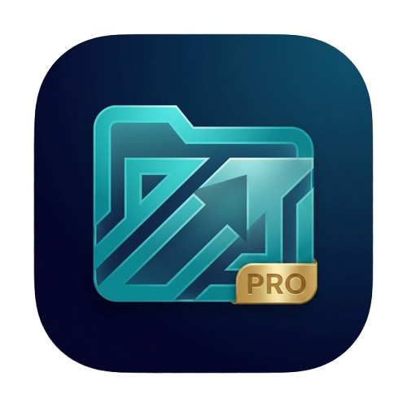
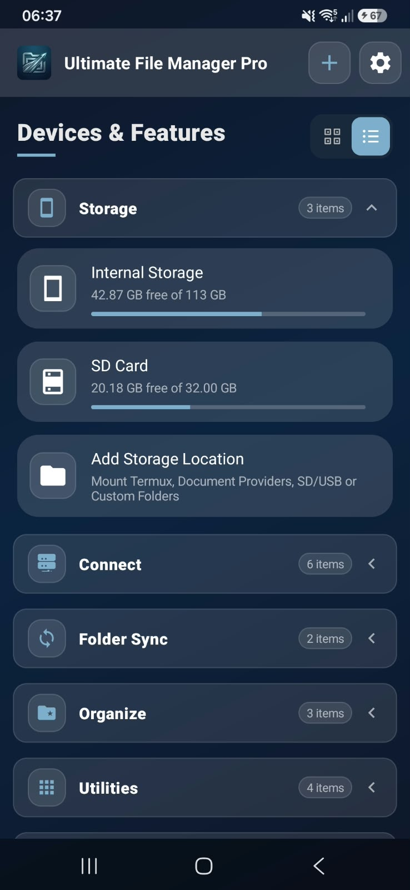
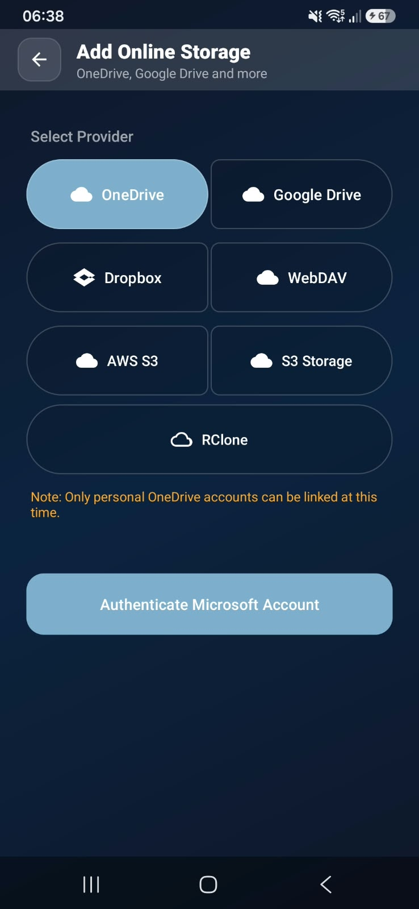
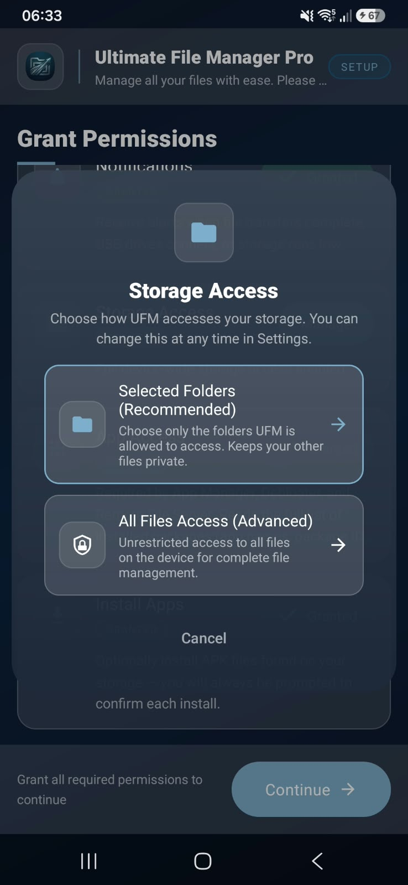
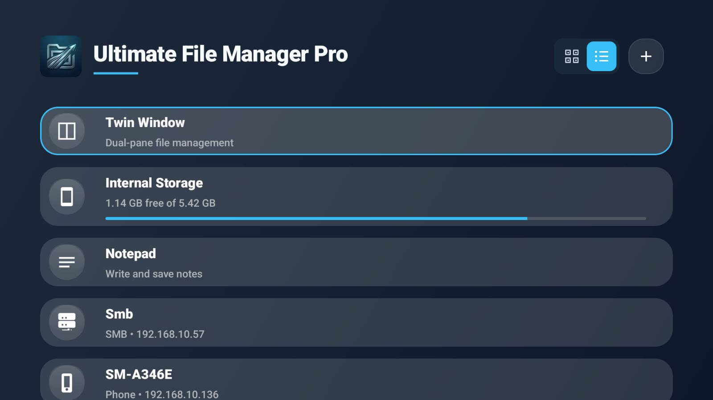

<div align="center">
  

  <h1>Ultimate File Manager Pro</h1>

  <p><b>The Ultimate Dual-Pane File Manager for Android Mobile, Android TV, and Windows PC.</b></p>

  <p>
    <a href="https://www.kilowatch.co.za"></a>
    <a href="https://github.com/Kilowatch/ultimate-file-manager-pro/releases"></a>
    <a href="https://play.google.com/store/apps/details?id=za.kilowatch.ultimatefilemanager"></a>
    <a href="LICENSE"></a>
    <a href="https://github.com/sponsors/Kilowatch"></a>
    <a href="https://xdaforums.com/t/app-free-ultimate-file-manager-pro-dual-pane-android-mobile-android-tv-foss-edition-available.4791958/"></a>
    <a href="https://www.reddit.com/r/UFManagerPro/"></a>
  </p>
</div>

---

## 📋 Table of Contents

- [Overview](#-overview)
- [Screenshots](#-screenshots)
- [Download Releases](#-download-releases)
- [Features](#-features)
- [FOSS Edition vs. Store Edition](#-foss-edition-vs-store-edition)
- [App Size & Storage Footprint](#-app-size--storage-footprint)
- [Windows Companion App](#-windows-companion-app)
- [Building the Android App](#-building-the-android-app)
- [AI Usage & Quality Assurance](#-ai-usage--quality-assurance)
- [Community & Support](#-community--support)
- [License](#-license)

---

## 🌟 Overview

**Ultimate File Manager Pro (UFM)** is a high-performance, feature-packed dual-pane file manager designed for power users across **Android Mobile**, **Android TV / Fire TV**, and **Windows PC**. Built with privacy, efficiency, and speed in mind, UFM allows seamless side-by-side file operations, LAN auto-discovery, remote PC pairing, and multi-protocol network storage access.

This repository contains the official **Free and Open Source Software (FOSS)** edition of UFM.

> [!NOTE]
> **Development & Quality Assurance:** AI assistance is utilized during development—primarily for UX/UI design—accounting for only about 20% of the application. All code is thoroughly inspected and must pass strict QA, UAT, and security reviews before being committed. [Learn more about our verification steps below](#-ai-usage--quality-assurance).

---

## 📦 Download Releases

Pre-compiled production binaries for all supported platforms are published on every [GitHub Release](https://github.com/Kilowatch/ultimate-file-manager-pro/releases/latest).

| Target Platform | Asset File Name | Description | Type |
|---|---|---|---|
| 📱 **Android Mobile** | [`mobile-foss-release.apk`](https://github.com/Kilowatch/ultimate-file-manager-pro/releases/latest/download/mobile-foss-release.apk) | Phones & Tablets build | APK Package |
| 📺 **Android TV / Fire TV** | [`tv-foss-release.apk`](https://github.com/Kilowatch/ultimate-file-manager-pro/releases/latest/download/tv-foss-release.apk) | D-pad remote optimized TV build | APK Package |
| 💻 **Windows Desktop** | [`ufm-windows-portable.exe`](https://github.com/Kilowatch/ultimate-file-manager-pro/releases/latest/download/ufm-windows-portable.exe) | Single-file portable companion (No installation required) | Standalone EXE |
| 💻 **Windows Desktop** | [`UltimateFileManagerProCompanion_x64-setup.exe`](https://github.com/Kilowatch/ultimate-file-manager-pro/releases/latest/download/UltimateFileManagerProCompanion_x64-setup.exe) | 64-bit Windows Setup Installer | Setup EXE |
| 💻 **Windows Desktop** | [`UltimateFileManagerProCompanion_x64_en-US.msi`](https://github.com/Kilowatch/ultimate-file-manager-pro/releases/latest/download/UltimateFileManagerProCompanion_x64_en-US.msi) | 64-bit Windows MSI Package Installer | MSI Installer |
| 📦 **Source Code** | [GitHub Releases](https://github.com/Kilowatch/ultimate-file-manager-pro/releases/latest) | Complete source code archives | Zip / Tarball |

> [!TIP]
> **Quick Installation on Android TV / Fire TV:**
> You can quickly install the TV edition on TV devices using the popular **Downloader** app by AFTVnews (available on Amazon Appstore & Google Play Store):
> 1. Open the **Downloader** app on your TV device.
> 2. Enter Quick Code **`1581139`** in the URL / Search bar.
> 3. The TV APK will automatically download and start installation.

---

## ✨ Features

- ⚡ **Dual-Pane Efficiency**: Side-by-side file viewing and management for effortless drag, drop, copy, and move operations.
- 🖥️ **Native Windows PC Companion**: Connect your PC and Android device over local Wi-Fi with PIN authentication and TLS certificate pinning—no cloud required.
- 🚀 **1-Click APK Sideloading**: Drag-and-drop `.apk` or `.xapk` files onto the PC Companion zone to install them remotely on your TV or phone.
- ☁️ **Self-Hosted Network Storage**: Full integration with **SMB**, **SFTP**, **FTP**, **WebDAV**, and **AWS S3**.
- 🛡️ **100% Privacy & FOSS**: Free of closed-source SDKs, Google tracking services, and invasive analytics.
- 📺 **Android TV Native Interface**: Full D-pad navigation, Leanback UI design, and quick action bars tailored for big-screen remotes.

---

## 📸 Screenshots

<!-- 📸 Screenshots — drop-in files → docs/screenshots/: mobile-main.jpeg, mobile-cloud.jpeg, mobile-storage-access.jpeg (portrait ~1080×2340), tv-browser.jpeg (16:9). See docs/screenshots/README.md. Remove this comment once all images are added. -->

### 📱 Mobile

<table align="center">
  <tr>
    <td align="center"></td>
    <td align="center"></td>
    <td align="center"></td>
  </tr>
  <tr>
    <td align="center"><b>Main screen</b></td>
    <td align="center"><b>Network &amp; cloud</b></td>
    <td align="center"><b>Storage access</b></td>
  </tr>
</table>

> 🔐 When you first set up UFM you choose how much storage it can reach: grant access to the **specific folders** you select, or allow **full access** to all files on your device. No root required.

### 📺 Android TV / Fire TV

**Big-screen browser**



---

## ⚖️ FOSS Edition vs. Store Edition

To comply with open-source software guidelines and maximize privacy, the **FOSS build** removes all proprietary analytics and store dependencies:

| Feature / Component | FOSS Build (GitHub) | Store Build (Google Play / Amazon) |
|---|---|---|
| **Privacy & Analytics** | 🚫 Zero Trackers / Zero Telemetry | Google Firebase / Crashlytics |
| **Proprietary Cloud (Google Drive, OneDrive, Dropbox)** | 🚫 Omitted (Requires closed SDKs) | ✅ Included |
| **Open Cloud (WebDAV, SFTP, SMB, FTP, S3)** | ✅ Full Access | ✅ Full Access |
| **In-App Billing** | 🚫 Direct GitHub Sponsor links | Google Play Store Billing |
| **Source Code License** | GPL v3.0 | Proprietary Build Variants |

---

## 📦 App Size & Storage Footprint

The standalone FOSS release is packaged as a universal, all-in-one APK (**~240 MB**) that includes native support for all 4 major Android CPU architectures (**ARM64**, **ARMv7**, **x86_64**, and **x86**). When installed on a device, only the device's specific architecture is used, resulting in an installed device footprint of **~100–185 MB**.

Instead of a barebones file explorer that offloads file operations to external cloud servers or requires 3rd-party companion apps, UFM is a **complete, 100% offline, privacy-first standalone workstation**:

| Component / Layer | Download Size | Installed Footprint | What It Does |
| :--- | :---: | :---: | :--- |
| ☁️ **Native Go Cloud & SMB Engine** | **~96 MB** *(All 4 ABIs)* | **~24 MB** | High-performance Go runtime, Rclone cloud sync & pure Go SMB2/3 |
| 🎬 **FFmpeg Video Thumbnailer** | **~42 MB** *(ARM ABIs)* | **~22 MB** | Built-in offline MKV, MP4, AVI, FLV thumbnail generator |
| 🖼️ **Modern Image Decoders (JXL & AVIF)** | **~75 MB** *(All 4 ABIs)* | **~17 MB** | Native JPEG XL and AVIF image decoding engines |
| 🗜️ **Archives, NFS & Network Engine** | **~4 MB** *(All 4 ABIs)* | **~1 MB** | High-speed ZSTD compression, native NFS v2/v3/v4 mounts |
| ⚡ **App Core, UI & Translations** | **~25 MB** | **~35–80 MB** *(with ART cache)* | 18 full language translations, PDF/Office viewers, Wi-Fi PC server |
| **TOTAL FOOTPRINT** | **~240 MB** *(Universal APK)* | **~100–185 MB** *(Device)* | **Saves 300 MB+ compared to installing 5+ separate apps** |

> 📖 *For a detailed non-technical and technical cross-architecture breakdown, see [`size.md`](size.md).*

---

## 🖥️ Windows Companion App

UFM includes a native Windows desktop companion built with Rust and Tauri for ultra-low resource usage and instant performance.

| Feature | Details |
|---|---|
| 📁 **Dual-Pane File Browser** | Browse local Windows drives alongside connected Android filesystems |
| ⬆️⬇️ **Wi-Fi Transfer** | Fast folder tree sync and byte-accurate transfer progress |
| 📦 **Remote Sideloading** | Instantly sideload applications onto TV or Mobile from your desktop |
| 🔐 **Local Security** | High-security TLS handshake with dynamic PIN verification |
| 🔍 **Zero-Conf Discovery** | Automatic LAN discovery (mDNS / local broadcast) |

### Building the Windows Companion
```bash
cd UFM-Windows
npm install
npm run tauri dev      # Development mode
npm run tauri build    # Production build (.exe & .msi)
```
*Detailed Windows documentation can be found at [UFM-Windows/README.md](UFM-Windows/README.md).*

---

## 🛠️ Building the Android App

To compile UFM from source using Gradle:

### Debug Builds (For local development)
```bash
# Android Mobile
./gradlew assembleMobileFossDebug

# Android TV
./gradlew assembleTvFossDebug
```

### Production Release Builds
```bash
# Android Mobile Release
./gradlew assembleMobileFossRelease

# Android TV Release
./gradlew assembleTvFossRelease
```
*Note: Signed release packages require configured signing keys in `app/build.gradle.kts` or `apksigner`.*

---

## 🛡️ AI Usage & Quality Assurance

Ultimate File Manager Pro maintains a transparent and disciplined approach to software development. While artificial intelligence is leveraged to accelerate development workflows, human oversight, rigorous engineering, and uncompromising security standards govern every single commit.

### 🤖 Role and Scope of AI (~20% of the Application)

AI tooling accounts for **approximately 20%** of the project's overall codebase, focused primarily on:
- **UX/UI Design & Ergonomics**: Designing modern layout structures, theme palettes (including high-contrast and colorblind modes), responsive dual-pane split views, and TV Leanback UI cards.
- **UI Prototyping & Styling**: Refining CSS/Tauri styles for the Windows companion and XML layouts for Android mobile and TV.
- **Micro-Interactions & Polish**: Scaffolding visual transitions, focus states, and user feedback cues.

> [!IMPORTANT]
> **Critical Systems Are 100% Human-Architected**: AI is never used autonomously for security-critical logic, low-level I/O primitives, cryptographic handshakes (TLS pinning / PIN pairing), background transfer engines, or protocol implementations (Go SMB/Rclone, SFTP, NFS, WebDAV, AWS S3).

### 🔍 How We Do It: The 4-Step Verification Gate

Every contribution—whether AI-assisted or human-written—must advance through four mandatory validation stages before it can be merged or committed to the repository:

```
┌────────────────────────┐
│  AI / Developer Draft  │
└───────────┬────────────┘
            │
            ▼
┌────────────────────────┐
│ 1. Code Inspection     │ ──► Manual review, static analysis & architectural validation
└───────────┬────────────┘
            │
            ▼
┌────────────────────────┐
│ 2. Quality Assurance   │ ──► Automated unit tests, syntax linters & layout regression
└───────────┬────────────┘
            │
            ▼
┌────────────────────────┐
│ 3. User Acceptance     │ ──► Real-device testing (Phone, Tablet, TV remote, PC)
└───────────┬────────────┘
            │
            ▼
┌────────────────────────┐
│ 4. Security Audit      │ ──► Zero-telemetry audit, scoped storage, R8 rules & pre-commit gate
└───────────┬────────────┘
            │
            ▼
┌────────────────────────┐
│   Committed to Repo    │
└────────────────────────┘
```

#### 1. 👁️ Step 1: Code Inspection & Human Peer Review
- **Full Source Inspection**: Every generated line or suggestion is critically audited line-by-line by human maintainers before entering the codebase.
- **Architectural Conformance**: Code must adhere strictly to repository patterns, including dual-pane coordination, clean separation of concerns, and Kotlin/Rust best practices.
- **Anti-Bloat & Dependency Minimization**: Generated code is stripped of unnecessary abstractions, unused dependencies, or boilerplate that could inflate APK/binary size or degrade runtime performance.

#### 2. 🧪 Step 2: Quality Assurance (QA)
- **Automated Test Execution**: All existing unit and integration tests (such as transfer preflight checks, conflict resolution, and state engines) are run to verify zero regressions.
- **Cross-Form-Factor Consistency**: Layouts are validated across dynamic aspect ratios, split-screen multi-window modes, and orientations (portrait and landscape).
- **TV D-Pad Focus Validation**: Android TV interfaces undergo specialized focus-engine verification to ensure smooth 5-way D-pad navigation without dead zones or focus traps.

#### 3. 📱 Step 3: User Acceptance Testing (UAT)
- **Physical Hardware Testing**: Builds are deployed and tested on physical hardware—including Android smartphones, tablets, Android TV / Fire TV streaming sticks/boxes, and Windows 10/11 desktops.
- **Real-World File Workflows**: Core file operations are tested under actual operating conditions: handling thousands of files, large multi-gigabyte transfers over local Wi-Fi, background task persistence, and network disconnect/resume scenarios.
- **Touch & Remote Ergonomics**: Real-world usability checks ensure touch targets meet accessibility standards on mobile, while remote navigation feels natural and fast on TV screens.

#### 4. 🔒 Step 4: Security & Privacy Audits (Pre-Commit Gate)
- **Zero-Telemetry & Privacy Enforcement**: The FOSS build is verified to ensure zero analytics SDKs, trackers, third-party network pings, or background data collection are present.
- **Least-Privilege Scoped Storage**: Permissions are audited to guarantee UFM only requests the exact Android permissions required for user-selected storage access.
- **Cryptographic & Network Safety**: TLS certificate pinning and PIN authentication logic for the Windows companion app are audited for tamper resistance.
- **R8 / ProGuard Optimization Audits**: Custom keep rules are reviewed to prevent reflection vulnerabilities and maintain >80% optimization, obfuscation, and shrinking scores without leaking symbols.
- **Commit Gate Sign-Off**: Only after passing all four verification levels is code authorized to be committed to the repository.

---

## 💖 Community & Support

Support project development, ask questions, or connect with the community:

- 🌐 **Website**: [www.kilowatch.co.za](https://www.kilowatch.co.za)
- 💖 **GitHub Sponsors**: [Sponsor @Kilowatch](https://github.com/sponsors/Kilowatch)
- 💬 **XDA Developers Forum**: [Ultimate File Manager Pro on XDA](https://xdaforums.com/t/app-free-ultimate-file-manager-pro-dual-pane-android-mobile-android-tv-foss-edition-available.4791958/)
- Reddit Community: [r/UFManagerPro](https://www.reddit.com/r/UFManagerPro/)

---

## 📄 License

Ultimate File Manager Pro is licensed under the **GNU General Public License v3.0**. See the [LICENSE](LICENSE) file for complete details.
